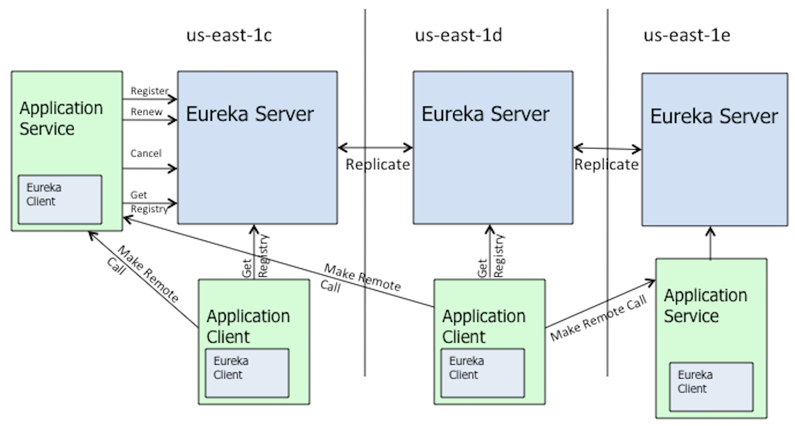

# **Eureka**

## **Eureka 体系架构**



---

## **Eureka Client**

### **Eureka Client 重要 API**

#### **InstanceInfo**

该类用于保存一个微服务主机的信息。一个该类实例就代表了一个微服务主机。该主机注册到 Eureka Server 就是将其 InstanceInfo 写入到了 Eureka 注册表，且被其它 Server 读取到的该 Server 的信息也是这个 InstanceInfo。

```java
// 记录当前 client 在 server 端的状态
private volatile InstanceStatus status = InstanceStatus.UP;
// 该状态用于在 client 提交注册请求与 Renew 续约请求时,计算 client 在 server 端的状态
private volatile InstanceStatus overriddenStatus = InstanceStatus.UNKNOWN;

// 续约信息
private volatile LeaseInfo leaseInfo;

// 记录当前 InstanceInfo 在 server 端被修改的时间戳
private volatile Long lastUpdatedTimestamp;
// 记录当前 InstanceInfo 在 Client 端被修改的时间戳
private volatile Long lastDirtyTimestamp;

// 重写了 equals() 方法：只要两个 InstanceInfo 的 instanceId 相同，那么这两个 InstanceInfo 就相同
@Override
public boolean equals(Object obj)
```

#### **Application**

一个 Application 实例中保存着一个特定微服务的所有提供者实例

```java
// 微服务名称
private String name;

// 保存着当前 name 所指定的微服务名称的所有 InstanceInfo
@XStreamImplicit
private final Set<InstanceInfo> instances;

// key 为 instanceId；value 为 instanceInfo
private final Map<String, InstanceInfo> instancesMap
```

#### **Applications**

该类封装了来自于 Eureka Server 的所有注册信息，可以称为"客户端注册表"，之所以要强调是客户端是因为，服务端的注册表是另外的一个 Map

```java
// key 为微服务名称，value 为 Application
private final Map<String, Application> appNameApplicationMap;
```

#### **Jersey 框架**

SpringCloud 中 Eureka Client 与 Eureka Server 的通信，以及 Eureka Server 之间的通信，均采用的是 Jersey 框架。

Jersey 框架是一个开源的RESTful 框架，实现了 JAX-RS 规范。该框架的作用与 SpringMVC 是相同的，其也是用户提交 URI 后，在处理器中进行路由匹配，路由到指定的后台业务。这个路由功能同样是由处理器完成的，只不过这个处理器不是 Controller，而是 Resource。

---

### **Eureka Client 分析**

1. #### **客户端解析入口**

   **@SpringBootApplication→spring.factories→EurekaClientAutoConfiguration→(内部类)RefreshableEurekaClientConfiguration.eurekaClient()→new CloudEurekaClient()→super→@Inject DiscoveryClient**

2. #### **获取注册表**

   **DiscoveryClient.fetchRegistry(false)**

   - getAndStoreFullRegistry()：获取全量注册表，并缓存到本地 region 注册表中 AtomicReference<Applications> localRegionApps。
   - getAndUpdateDelta(applications)：获取增量注册表，并更新本地缓存数据。
   - 本地缓存分为两类:
      - 缓存本地 Region 的注册表。AtomicReference<Applications> localRegionApps。
      - 缓存远程 Region 的注册信息。Map<String, Applications> remoteRegionVsApps：key：远程 Region，value：该远程 Region 的注册表 Applications

   >Eureka Client 从 Eureka Server 中获取注册表分为两种情况：
   >
   >1. **一种是将 Server 中所有的注册信息全部下载到当前客户端本地并进行缓存，这种称为全量获取**。一般是在应用启动时第一获取注册表数据时发起的。这次获取的目的是为了让应用能够马上进行服务，所以服务端返回的注册信息并没有区分 region，但这些注册信息包含了所有本地 region 与远程 region 中的注册数据。
   >2. **一种是将 Server 中最近发生变更的注册信息下载到当前客户端本地，然后根据变更修改本地缓存中的注册信息，这种称作增量获取**。一般是在第二次获取注册表数据时发起的。这次获取的目的不仅仅是为了能获取到据自己最近的微服务信息，而且是为了保证服务的可用性（AP），若当前 region 中无需要的服务时，可以从远程 region 处获取，所以服务端在处理增量请求时返回的注册信息对 region 进行了区分，而客户端也对本地 region 与远程 region 中的注册信息分别进行了缓存。
   >
   >
   >
   >在客户端在启动时第一次下载就属于全量下载，然后每隔 30s 从 Server 端下载一次就属于增量下载。无论那种请求，客户端都是通过 Jersey 框架向 Server 端发送一个 **GET** 请求，只不过，不同的下载方式，提交请求时所携带的参数不同。
   >
   >
   >
   >客户端向服务端发送获取增量注册表请求时，服务端会给客户端返回一个 delta，这个 delta 是一个 Applications 类型的变量，这个变量存在以下两种情况：
   >
   >1. 服务端返回的 delta 值为 null，则表示服务端基于安全考虑，禁止增量下载，此时服务端会进行全量下载
   >2. 服务端返回的 delta 值不为 null，但其包含的 Application 数量为 0，则表示没有更新的内容。若数量大于 0，则表示有更新的内容，然后将更新的内容添加到本地缓存注册表中。
   >
   >
   >
   >当服务端在接收到客户端的获取增量注册表请求时，其并不知道哪些实例(Instance)对于这个客户端来说是更新过的。但是在服务端中维护着一个**”最近变更队列“**，无论对于那个客户端的增量请求，服务端都是将该队列中的实例变更信息发送给客户端。同时，服务端中有一个定时任务，当这个实例变更信息不在属于”**最近变更**“条件时，会将该数据从队列中请求，即有定时任务定时清理**过期数据**。
   >
   >当客户端接收到服务端返回的增量变更数据后，客户端会有一个判断机制，可以判断出这个增量数据对于自己来说是否出现了变更丢失。即出现了队列中清除掉的变更信息并没有更新到当前客户端本地。若发生更新丢失，客户端会发起全量获取注册表请求，以保证客户端获取到的注册表是最完整的注册表。
   >
   >
   >
   >客户端接收到服务端的增量变更数据后，这个增量变更数据无论是”**修改变更**“还是”**添加变更**“，都是采用了”**添加变更**“的处理方式。无论是添加的 **InstanceInfo** 还是修改的 **InstanceInfo**，客户端首先根据该实例的 **InstanceId**，从本地 **InstanceInfo** 的 set 集合中将其删除，然后再将该增量变更数据重新添加进 set 集合中。只不过，对于添加变更，其原来的 set 集合中找不到其要删除的旧数据而已。之所以能够根据如此操作，是因为 set 集合的元素 **InstanceInfo **重写了 equals() 方法，防止因 InstanceId 相同，实例数据不同而造成的数据变更失败。

3. #### **向服务端注册**

   **DiscoveryClient.register()**

   ##### **Client 提交 register() 的时机**

   1. 在应用启动时可以直接进行 register() 注册，但前提是在配置文件中配置启动时注册
   2. 在续约 renew() 时，如果服务端返回的是 NOT_FOUND(404)，则提交 register() 注册请求
   3. 当客户端数据发生变更时，监听器触发调用 register() 注册请求

   > Eureka Client 向 Eureka Server 提交的注册请求，实际是通过 Jersey 框架完成的一次 **POST** 请求，将当前客户端的封装对象 InstanceInfo 提交到服务端，写入到服务端的注册表中。但这个请求在默认情况下并不是在客户端启动时就直接提交的，而是在客户端向服务端发送续约信息时，由于其未在服务端中注册过，所以服务端会在处理其续约请求时返回 **404**，然后客户端才会发起注册请求。当然，若客户端的续约信息发生变更时，客户端也会提交注册请求。

4. #### **初始化定时任务（定时更新本地缓存客户端注册表、定时续约、定时更新客户端数据至服务端）**

   **DiscoveryClient.initScheduledTasks()**

   - DiscoveryClient.CacheRefreshThread.run()→refreshRegistry()：定时更新本地缓存注册表

   - DiscoveryClient.HeartbeatThread.run()→renew()：定时续约。续约 renew() 时，如果服务端返回的是 NOT_FOUND(404)，则提交 register() 注册请求

   - InstanceInfoReplicator.onDemandUpdate()：按需更新（监听器监听本地客户端数据发生变更，从而触发监听器回调按需更新方法）

   - InstanceInfoReplicator.run()：定时更新客户端数据至服务端

     > Eureka Client 需要定时从 Eureka Server 中更新注册信息，使用了 one-shot action 的一次性定时器实现了**重复**定时任务，这个**重复**过程是通过其一次性的任务实现的，当这个一次性任务执行完毕后，在 finally 中会调用启动下一次的定时任务。
     >
     > 之所以使用 one-shot action 的定时器来完成一个**重复**的任务，主要的目的是方便控制**延迟时间**，保证任务的顺利完成。定时器要执行的任务是通过网络从 server 下载注册信息，由于网络传输存在不稳定性，不同的传输数据可能走的网络链路是不同的，而不同的链路的传输时间可能也是不同的。例如本次传输超时，下次重试可能走的链路不同，就不超时。
     >
     > **重复**定时器的执行原理是，本次任务的开始，必须在上一次的任务完成之后，不存在超时，即只要没完成就不会通过执行下次任务进行重试。使用 one-shot action 定时器完成重复定时任务时，如果本次定时任务出现了超时，则可以在下次任务执行之前增大定时器的**延迟时间**，当然，如果下载速率都很快，也可以将已经增大的**延迟时间**再进行减少，方便控制延迟时间，保证任务的顺利完成。
     >
     >
     >
     > 客户端会向服务端进行定时续约（心跳）。其最终就是通过 Jersey 框架向服务端提交一个 **PUT** 请求，该 **PUT** 请求没有携带任何请求体，而服务端仅仅就是接收到一个 **PUT** 请求，但服务端能够知道这个请求的发送者的 **InstanceId**，然后通过这个 **InstanceId** 从注册表中找到其实例数据（InstanceInfo），如果找到该实例数据，则返回该实例数据；如果没找到，则返回 **404**。
     >
     >
     >
     > 客户端会定时检测其实例数据是否发生了变更，只要发生了以下两种情况的变更，就将变化后的信息发送给服务端执行 register() 注册请求：
     >
     > 1. 检测数据中心中的关当前 InstanceInfo 的信息是否发生变更
     > 2. 检测配置文件中当前 InstanceInfo 中的续约信息是否发生变更
     >
     >
     >
     > 客户端在做定时更新续约信息给服务端时，有一个定时任务，来定时查看本地配置文件中的 InstanceInfo 是否发生了变更。这个定时任务在服务端启动时通过 start() 方法启动了定时任务，该定时器是一个 one-shot action 定时器，其会调用 InstanceInfoReplicator 的 run() 方法，而该方法会再次启动一个 one-shot action 的定时任务，实现了”**重复**“定时执行。然而，当 InstanceInfo 的状态发生变更后会调用一个按需更新的方法 onDemandUpdate()，该方法同样会调用 InstanceInfoReplicator 的 run() 方法，再启动一个 one-shot action 的定时任务，实现了”**重复**“定时执行。这样的话，只要发生异常状态变更，就会启动一个”**重复**“的定时任务持续执行下去，那么若 InstanceInfo 的状态多次发生变更，是否就会启动很多的一直持续执行的定时任务呢？
     >
     > - 答案是不会出现**多路**定时任务的。首先因为无论是 start() 方法还是 InstanceInfoReplicator 的 run() 方法，在启动了定时任务后，都会将定时任务实例 future 写入到了一个原子引用类型的缓存中，且后放入的会将先放入的覆盖，即这个缓存中存放的始终为最后一个定时任务；其次是这个 onDemandUpdate() 方法，在其调用 InstanceInfoReplicator 的 run() 方法之前，会先将这个缓存中的异步操作取消掉（cancel），然后才会启动新的定时任务，所以，只会同时存在一个定时任务。
     >
     >
     >
     > **客户端的续约配置信息默认情况下是允许动态变更的，但为了限制变更的评率，客户端采用了令牌桶算法**。该算法实现中维护着一个队列，首先所有元素需要进入到队列中，当队列满时，为进入到队列中的元素将被丢弃。进入到队列中的元素是否可以被处理，需要看其是否能够从令牌桶中拿到令牌。一个元素从令牌桶中拿到一个令牌，那么令牌桶中的令牌数量就会减一，若元素生成的速度较快，则其从令牌桶中获取到令牌的速率就会比较大。一旦令牌桶中没有了令牌，则队列很快就会变慢，那么再来的元素就会被丢弃。
     >
     >
     >
     > 客户端的操作中有两处操作可以引发客户端 InstanceInfo 的最新修改时间戳「**lastDirtyTimestamp**」的变化：
     >
     > 1. 在进行第一次发送续约时，由于服务端中没有发现该客户端的实例数据，而返回了 **404**，此时的客户端修改了 **lastDirtyTimestamp** 的值；
     > 2. 在续约信息发生变更时，客户端修改了 **lastDirtyTimestamp** 的值

5. #### **服务离线**

   1. 基于Actuator监控器实现，直接向客户端发送 POST 请求请求

      - 服务下架 **DiscoveryClient.shutdown()**：http://localhost:8083/actuator/shutdown，无需请求体。

        > 客户端通过 Actucator 提交的 **POST** 请求的 shutdown 进行服务下架，就是要销毁客户端实例，而该客户端实例是在客户端的自动配置类中通过 **@Bean** 方法创建的。所以，这个下架处理方法应该是 **@Bean** 注解的 destoryMethod 属性指定的方法。
        >
        > 客户端通过 Actucator 提交的 **POST** 请求的 shutdown 进行服务下架时，其内部主要完成了以下四步：
        >
        > 1. 将状态变更监听器删除
        > 2. 停止了一堆定时任务，并关闭了定时器
        > 3. 通过 Jersey 框架向服务端提交了一个 **DELET** 请求
        > 4. 关闭了一些其它相关工作

      - 服务下线  **Spring-Cloud-netflix-eureka-client#EurekaServiceRegistry.setStatus()**：http://localhost:8083/actuator/serviceregistry，含请求体。（该方法称为**服务平滑上下线**，从 Spring Cloud 2020.0.0 版本开始，服务平滑上下线的监控终端由 service-registry 变更为了 serviceregistry）

        ```java
        {
        	"status":"OUT_OF_SERVICE" 
        }
        --------------------------
        {
        	"status":"UP" 
        }
        --------------------------
        {
        	"status":"CANCEL_OVERRIDE" 
        }
        
        // 特殊状态 CANCEL_OVERRIDE：用户提交的状态修改请求中指定的状态，除了 InstanceInfo 的内置枚举类 InstanceStatus 中定义的状态外，还可以是CANCEL_OVERRIDE 状态。若用户提交的状态为 CANCEL_OVERRIDE，则 Client 会通过 Jersey 向 Server 提交一个 DELETE 请求，用于在 Server 端将对应 InstanceInfo 的 overridenStatus 修改为 UNKNWON，即删除了原来的 overridenStatus 的状态值。此时，该 Client 发送的心跳 Server 是不接收的。Server 会向该Client 返回 404。
        ```

        > 用户通过平滑上下线的方式对客户端的状态进行修改，这个状态修改请求是被客户端的 **ServiceRegistryEndpoint** 类实例的 **setStatus()** 方法处理的。这个类实例是在 Spring Cloud 应用启动时被加载创建的。具体来说，spring-cloud-starter 依赖于 spring-cloud-common，而该 common 依赖加载并实例化了 **ServiceRegistryAutoConfigration** 配置类，在该配置类中实例化了 **ServiceRegistryEndpoint** 对象。
        >
        >
        >
        > 用户通过 Actuator 的 service-Registry 监控终端提交状态修改请求，服务平滑上下线就属于这种情况，但这种情况不仅限于服务平滑上下线：
        >
        > 1. 当客户端提交的状态为 **UP** 或 **OUT_OF_SERVICE** 时，属于平滑上下线场景，该请求会被客户端接收，并直接再以 **PUT** 请求的方式提交给服务端，其在客户端处并未修改客户端实例的任何状态，服务端接收请求后，会从注册表中找到该客户单实例数据 InstanceInfo，并将其 overriddenStatus、Status修改 为指定状态；
        > 2. 当客户端提交的状态为 **CANCEL_OVERRIDE** 时，在服务端将对应的客户端实例数据 InstanceInfo 中的 overriddenStatus 从一个缓存 map 中删除，并将其 overriddenStatus 与 status 属性值修改为 UNKNWON 状态。
        > 3. 当服务端的某个客户端实例数据 InstanceInfo 的 overriddenStatus 属性值是 **UNKNWON**，则这个客户端发送的续约心跳请求，服务端时不处理的，直接返回 **404**
        >
        >
        >
        > 用户通过 Actuator 的 service-Registry 监控终端提交状态修改请求，这个状态一般为五种 {**UP、DOWN、OUT_OF_SERVICE、STARTING、 UNKNOWN**} 中 的 **UP** 或 **OUT_OF_SERVICE**，也可以是 **CANCEL_OVERRIDE**，但用户提交的不是这六种情况之一，系统会将其最终归结为 **UNKNWON** 状态

   2. 直接向服务端发送请求

      - 服务下架：通过向 eureka server 发送 DELETE 请求来删除指定 client 的服务。？？？？？

        ```text
        http://${server}:${port}/eureka/apps/${serviceName}/${instanceId}
        ```

      - 服务下线：通过向 eureka server 发送 PUT 请求来修改指定 client 的 status，其中 ${value} 的取值 为：OUT_OF_SERVICE 或 UP。

        ```text
        http://${server}:${port}/eureka/apps/${serviceName}/${instanceId}/status?value=${value}
        ```

---


## **Eureka Server**

### **Eureka Server 重要 API**

#### **InstanceResource**

Jersey 框架处理器，用于处理客户端发送的续约请求、状态修改请求、客户端下线/下架请求等。

#### **ApplicationResource**

Jersey 框架处理器，用于处理客户端发送的注册请求。

#### **ApplicationsResource**

Jersey 框架处理器，处理所有与 Applications 相关的请求（客户端的全量、增量下载等）。

#### **AbstractInstanceRegistry**

处理来自eureka客户端的所有注册请求

```java
// 服务端本地注册表。key：微服务名称；value：客户端的实例数据→InstanceInfo
private final ConcurrentHashMap<String, Map<String, Lease<InstanceInfo>>> registry

// 服务端缓存客户端当前状态数据。key：InstanceId；value：客户端实例的当前状态 status
// 当前状态取值：InstanceStatus{UP、DOWN、STARTING、OUT_OF_SERVICE、UNKNOWN}
protected final ConcurrentMap<String, InstanceStatus> overriddenInstanceStatusMap

// 最近变更队列
private ConcurrentLinkedQueue<RecentlyChangedItem> recentlyChangedQueue
```

> 服务端中的这个注册表（registry）是一个双层 Map，外层 map 的 key 为微服务名称，value 为内层 map。内层 map 的 key 为 instanceId，value 为 Lease 对象。Lease 对 象中包含一个持有者 Holder 属性，表示该 Lease 对象所属的 InstanceInfo。
>
> 当客户端将服务端的注册表下载到本地，该注册表时以 Applications 的形式出现的。Applications 中维护着上面的 Map 集合，key 为微服务名称，value 为 Application 实例。该 Application 实例中包含了所有提供该微服务名称的 InstanceInfo 信息，因为 Application 中维护着一个 Map，key 为 InstanceId，value 为 InstanceInfo。

#### **ResponseCacheImpl**

缓存注册表信息，用于处理客户端的下载请求（全量下载与增量下载）

```java
private final ConcurrentMap<Key, Value> readOnlyCacheMap
private final LoadingCache<Key, Value> readWriteCacheMap
```

> **readOnlyCacheMap 与 readWriteCacheMap 的数据来源以及他们之间的关系**
>
> 1. 在 ResponseCacheImpl 构造器中创建并初始化了这个读写缓存 readWriteCacheMap。
> 2. .readOnlyCacheMap 的数据来自于 readWriteCacheMap，在 ResponseCacheImpl 构造器中定义并开启了一个定时任务，用于定时从 readWriteCacheMap 中更新 readOnlyCacheMap 中的数据，这样，只要 readWriteCacheMap 中的数据若发生了变更，那么 readOnlyCacheMap 中的数据也随之更新了。
> 3. 使用定时任务更新 readOnlyCacheMap 中数据的好处是，为了保证对 readWriteCacheMap 的迭代稳定性。即将读写进行了分离，分离到了两个共享集合。但这种解决方案存在一个很严重的弊端：读、写两个集合的数据无法保证强一致性 ，即只能做到最终一致性 。所以这种方案的应用场景是，对数据的实时性要求不是很高，对数据是否是最新数据要求不高的场景。


---

### **Eureka Server 分析**

> Spring Cloud 中 EurekaServerAutoConfiguration 自动配置类被实例化的一个前提条件是，容器中存在一个 Marker 类实例，这个实例就是 EurekaServer 的一个标识，一个开关。这个实例被添加到容器中，Eureka Server 就开启了。它是在 Eureka Server 启动类上的 @EnableEurekaServer 注解中被实例化并添加到容器中的，所以，若没有添加该注解，Eureka Server 启动类在启动时是不会创建 Eureka Server 的。

1. #### 处理客户端注册请求

   **ApplicationResource.addInstance()**

   server 完成的操作：

   - 将最新的客户端写入到注册表中
   - 将本次操作记录到最近变更队列”recentlyChangedQueue“缓存中
   - 本地注册完成后，进行 eureka-server 之间的数据同步

   ```java
   // 每分钟续约次数阈值的计算：
   this.numberOfRenewsPerMinThreshold = (int) (this.expectedNumberOfClientsSendingRenews
                   * (60.0 / serverConfig.getExpectedClientRenewalIntervalSeconds())
                   * serverConfig.getRenewalPercentThreshold());
   
   /**
    * == 客户端数量 * (60 / 「期望的客户端发送续约心跳的间隔时间，默认是30s」) * 「自我保护机制开启的阈值因子，默认是0.85」
    * == 客户端数量 * 每个客户端每分钟发送心跳的数量 * 阈值因子
    * == 所有客户端每分钟发送心跳数量 * 阈值因子
    * == 当前服务端开启自我保护机制的每分钟最小心跳数量(续约阈值)
    *
    * 一旦自我保护机制开启了，那么就将当前server保护了起来，即当前server注册表中的所有client均不会过期，
    * 即使当前client没有在指定时间内「默认90s」发送续约，也不会将其从注册表中删除。这是为了保证server的可用性，即保证了"AP"
    *
    * expectedNumberOfClientsSendingRenews 设置的越大，当前server开启自我保护机制的每分钟最小心跳数量觉越大，就越容易开启自我保护机制。
    */
   ```

   > 服务端在处理注册请求时，注册表中可能会出现新注册的客户端在注册表中已经存在的情况，这是因为，当客户端的 InstanceInfo 的续约信息发生了变更，客户端的“**定时更新 InstanceInfo 给服务端**”的定时任务发出的是 register() 请求，但该客户端其实在之前已经注册过了，因此就出现了注册表中已经存在该 InstanceInfo 的情况。
   >
   >
   >
   > 服务端在处理注册的客户端在注册表中已经存在的情况时，会出现当前新注册的 InstanceInfo 中的 lastDirtyTimestamp 比注册表中缓存的当前这个 InstanceInfo 中的 lastDirtyTimestamp 小的情况，即后注册的反而过时了，这是因为，若客户端的 InstanceInfo 的续约信息相继发生了两次变更，客户端提交了两次 register() 请求，但由于网络原因，第二次注册请求先到达服务端被处理，当第一次注册请求到达后就出现”后到达的注册请求中携带的 InstanceInfo 的 lastDirtyTimestamp 反而过时“的情况了。
   >
   >
   >
   > 服务端在处理注册请求时，可能会出现新注册的 registrant 的 OverriddenStatus 状态不是 UNKNOWN 的场景，这种场景的出现只有一种情况，就是当前注册的 registrant 是由于其续约信息发生了变更而引发的注册，其在续约信息变更之前用户通过 Actuator 修改过状态。当然，这种通过 Actuator 修改的状态仅仅修改的是服务端注册表中的状态，并没有修改客户端的任何状态。这个修改的结果实际是通过客户端定时更新客户端注册表时，将所有变更信息下载到客户端，其中就包含了自己状态的修改信息。

2. #### 处理客户端续约请求

   **InstanceResource.renewLease()**

   > 客户端提交的续约请求，是一个没有携带任何请求体参数的 **PUT** 请求，不过其在请求 URI 中携带了 InstanceId，以及当前客户端状态，服务端处理续约请求，完成了一些操作：
   >
   > 1. 当服务端接收到续约请求后，根据注册表中当前 InstanceInfo 的状态信息，计算出其新的状态，让后更新对应属性值
   > 2. 本地处理完成后，进行 eureka-server 之间的数据同步。在这个过程可能会导致 server 之间overridden 状态的不一致，所以又进行了该状态的统一操作。
        >    - Eureka 是 AP 的，是允许出现 Server 间数据不一致的。例如，当前 Eureka 中由于客户端下架请求而从注册表中删除了某 Client，在进行 Server 间同步时，由于另一个 Server 处于自我保护模式，所以其是不能删除该 Client 的。此时就出现了 Server 间数据的不一致。
   >    - 无论是直接处理客户端的续约请求，还是处理服务端之间续约同步，服务端对于续约的处理，根本不涉及 lastDirtyTimestamp 时间戳，及 overridden 状态。这一点从续约的源码中可以看出来，那么就有可能出现以下场景：客户端通过 Actuator 修改了状态，而这个状态修改操作在服务端之间同步时没没有同步成功，出现了 server 之间对于同一个 InstanceInfo 中的 overridden 状态的不一致。
   >    - 虽然 Eureka 本身是 AP 的，但其仍是尽量想让 Eureka 之间实现同步，所以在其发生频繁续约中解决了这个问题，只不过，由于续约本身根本不设计 overridden 状态，仅靠续约时解决不了的。所以需要在 Eureka Server 的配置文件中添加专门的配置来解决这个问题，这个属性默认是开启的。
   >
   >
   >
   > 服务端在处理续约请求时，如发现其计算的当前 InstanceInfo 的 status 状态为 **UNKNOWN**，说明这个计算结果是在 overriddeExistsRule 规则中计算出的结果，即当前 InstanceInfo 的 overridden 状态为 **UNKNOWN**。对于一个 InstanceInfo 来说，可以从缓存 map 中读取到其 overridden 状态为 **UNKNOWN**，只能有一种情况，就是这个 UNKNOWN 的 overridden 状态是通过 Actuator 的 CANCEL_OVERRIDE 修改的状态，即用户取消了该 InstanceInfo 的 overridden 状态，使其**下线**了。也就是说，服务端在进行续约处理时，若发现其计算的当前 InstanceInfo 的 status 状态为 UNKNOWN，这说明该 InstanceInfo 已经不对外提供服务了。

3. #### 处理客户端状态修改请求【"OUT_OF_SERVICES"、"UP"】

   **InstanceResource.statusUpdate()**

   > 服务端接收到客户端提交的状态修改请求后 ，先根据该客户端的**微服务名称**以及 **InstanceId** 在服务端注册表中进行查找，如没有找到，则直接返回 **404**，如果找到了，这执行以下任务。
   >
   > 1. 将客户端修改请求中的新状态写入到注册表中
        >    - 使用新状态替换缓存 overriddenInstanceStatusMap 中的老状态
   >    - 修改 instanceInfo 的 overriddenStatus 状态为新状态
   >    - 修改 instanceInfo 的 status 状态为新状态
   >    - 更新来自于请求参数的客户端修改时间戳 lastDirtyTimestamp
   >    - 将本次修改形为记录到 instanceInfo 的行为类型中
   >    - 修改服务端修改时间戳 lastUpdatedTimestamp
   >    - 将本次修改记录到最近更新队列 recentlyChanngeQueue 中
   > 2. 本地注册表修改完后，进行 eureka-server 之间的数据同步
        >    - 若这个变更时由客户端直接请求的，则当前服务端会遍历所有其他的服务端，通过 Jersey 框架向每一个其他服务端发送变更请求，这样就实现了 server 之间的数据同步
   >    - 若这个变更是由其他服务端发送的变更请求，则其仅仅会在本地变更一下即可，不会再向其他服务端发送变更请求了，以防止出现无线递归。

4. #### 处理客户端下线「删除 overridden 状态」请求

   **InstanceResource.deleteStatusUpdate()**

   > 注意：被没有将该客户端从注册表中"物理删除"，仅为"逻辑删除"，即本地注册表中 status 设置为 UNKNOWN
   >
   > 客户端提交的 **CANCEL_OVERRIDE** 状态修改请求，即服务下线请求，服务端的 deleteStatusUpdate() 方法来处理。首先根据该客户端的微服务名称以及 InstanceId 在服务端注册表中进行查找，如果没有找到，直接返回 **404**，如果找到了，则执行以下操作
   >
   > 1. 在服务端中删除 overridden 状态
        >    - 将 InstanceInfo 在缓存集合 overriddenInstanceStatusMap 中的 Entry 删除
   >    - 将 InstanceInfo 中的 overridden 状态修改为 UNKNOWN
   >    - 将 InstanceInfo 中的 status 状态修改为 UNKNOWN
   >    - 将本次修改记录到了最近更新队列“ recentlyChangedQueue ”缓存中
   >    - 修改注册表中该客户端的 lastUpdatedTimestamp
   > 2. 本地更新完成后，进行 eureka-server 之间的数据同步

5. #### 处理客户端下架请求

   **InstanceResource.cancelLease()**

   server 完成的操作：

   - 将该客户端从注册表中删除，返回被删除的 lease 数据。（Lease<InstanceInfo> 相当于 InstanceInfo）
   - 将该客户端的 overriddenStatus 从缓存 overriddenInstanceStatusMap 中删除
   - 将本次修改记录到了最近更新队列“ recentlyChangedQueue ”缓存中
   - 修改注册表中该客户端的 lastUpdatedTimestamp
   - 本地更新完成后，进行 eureka-server 之间的数据同步

6. #### 处理客户端全量、增量下载下载请求

   **ApplicationsResource.getContainers()→ResponseCacheImpl.get()→getValue()→readOnlyCacheMap/readWriteCacheMap→AbstractInstanceRegistry.getApplicationsFromMultipleRegions()**

   **ApplicationsResource.getContainerDifferential()→ResponseCacheImpl.get()→getValue()→readOnlyCacheMap/readWriteCacheMap→AbstractInstanceRegistry.getApplicationDeltasFromMultipleRegions**

   **readOnlyCacheMap 与 readWriteCacheMap 的数据来源以及他们之间的关系**

   - 在 ResponseCacheImpl 构造器中创建并初始化了这个读写缓存 readWriteCacheMap，封装了全量的注册表数据。
   - readOnlyCacheMap 的数据来自于 readWriteCacheMap，在 ResponseCacheImpl 构造器中定义并开启了一个定时任务，定时将 readWriteCacheMap 中的数据更新到 readOnlyCacheMap 中，这样，只要 readWriteCacheMap 中的数据若发生了变更，那么 readOnlyCacheMap 中的数据也随之更新了。
   - 使用定时任务更新 readOnlyCacheMap 中数据的好处是，为了保证对 readWriteCacheMap 的迭代稳定性。即将读写进行了分离，分离到了两个共享集合。但这种解决方案存在一个很严重的弊端：读、写两个集合的数据无法保证强一致性 ，即只能做到最终一致性 。所以这种方案的应用场景是，对数据的实时性要求不是很高，对数据是否是最新数据要求不高的场景。

   > readOnlyCacheMap 与 readWriteCacheMap 存在某一时刻数据不一致的问题，但 Eureka 还是设计成从只读缓存中读取数据，这样设计的目的是什么？
   >
   > - 这样设计的目的是为了保证在并发环境下”集合迭代稳定性“。集合迭代稳定性指的是，当一个共享变量是一个集合并且存在并发读写操作时，要保证在对共享集合进行读操作时，能够读取到稳定的数据，即在读取时不能对其执行写操作，但又不能妨碍写操作的执行。此时就可以将集合的读写功能进行分离，创建出两个共享集合，一个专门用于处理写功能，外来的数据写入到这个集合；另一个专门用于处理读功能，定时同步写集合中的数据。这种方案存在的弊端是，无法保证只读集合中的数据与读写集合中的数据的强一致性。所以这种方案的应用场景是对数据的实时性要求不高的情况下使用。
   >
   >
   >
   > 服务端在处理客户端的全量下载请求时，读取的是当前**服务端注册表 register** 中的数据
   >
   > 服务端在处理客户端的增量下载请求时，读取的是**最近更新队列 recentlyChangeQueue** 中的数据。这个**最近更新队列**中定义的**最近时间**是可以通过配置文件属性来设定的，默认为 3 分钟。当队列中的元素超过三分钟，系统会自动将这些过期的元素删除，这个删除操作是一个重复的定时任务，在 AbstractInstanceRegistry 类的构造器中被创建并启动，默认每 30s 执行一次。

7. #### 定时清理过期客户端

   **spring.factories→EurekaServerAutoConfiguration→@Import(EurekaServerInitializerConfiguration.class)→EurekaServerInitializerConfiguration.start()→PeerAwareInstanceRegistryImpl.openForTraffic()**

   先取出过期的客户端数据，然后再计算出在配置的存活阈值下的可删除客户端数量，选择过期客户端数量与可删除客户端数量之间最小值，使用洗牌算法进行删除，调用是服务下架接口，即从注册表中删除过期客户端数据。

   > 服务端对续约过期的客户端的定时清除任务是在服务端启动时，专门创建了一个新的线程来执行的。确切的说，是 EurekaServerAutoConfiguration 在做实例化过程中完成的该定时任务线程的创建、执行。
   >
   > 这个定时任务首先查看了自我保护模型是否已经开启，若已经开启则不进行清除。若没有开启，则首先会将所有失联的 Instance 集中到一个集合中，然后再计算”为了不启动自我保护模型，最多只能清除多少个 Instance 数量“，在进行清除时不能超过这个最大值。
   >
   > 服务端在定时清理的过程中，有一个”补偿时间“，什么是”补偿时间“？举例理解”补偿时间“：
   >
   > - 例如，正常情况下，若每隔 5s 清除一次过期对象，而清除一次需要 2s，则在第 5s 时开始清除 0~5s 期间内的过期对象。第 10s 时开始清除 5s~10s 期间的过期对象。若清除操作需要 6s，则在第 5s 时会开始清理，其清除的是 0~5s 期间内的过期对象，按理说应该在第 10s 开始清理 5s~10s 期间内的过期对象，但由于上次的清理任务还未结束，所以在第 10s 时还不能开始清理，而在第 11s 时才开始第二次清理操作。因为已经过了 10s 这个时间点，此时需要清除的对象就应该是 5s~11s 期间内的过期对象，而多出的那 1s 就是需要补偿的时间。
   >
   > 在定时清除过程中，系统会从过期对象数量 expiredLeases.size() 与开启自我保护的阈值数量 evictionLimit 这两个数组中选择一个最小的数进行清除。根据这个最小值进行清除，会不会导致自我保护模式永远无法启动的情况？若出现了很多的过期对象，即这个 expiredLeases.size() 很大，而 evictionLimit 是固定的，那么其清除的一定是evictionLimit 这个过期对象，这样的话是否自我保护模型永远无法启动？
   >
   > - 答案为否定的。自我保护模式的启动并不是由这个清除任务决定的，而是由其他线程决定的。只要发现收到的续约数据低于阈值，那么就会启动自我保护模式。这里选择最少的进行清除，是为了尽量少的做清除，给哪些没有被清除的对象一定的机会。对于那些由于网络抖动而导致的失联，当网络良好时，就会恢复。若不给机会直接清除，就没有恢复的机会了。

8. #### Eureka Server 处理过程中的读写锁问题

   **读写锁使用场景**：

   | 方法名                       | 操作的共享集合                 | 读/写操作 | 添加的锁 |
      | ---------------------------- | ------------------------------ | --------- | -------- |
   | register()：注册             | registry、recentlyChangedQueue | 写        | 读锁     |
   | statusUpdate()：状态修改     | registry、recentlyChangedQueue | 写        | 读锁     |
   | internalCancel()：下架       | registry、recentlyChangedQueue | 写        | 读锁     |
   | deleteStatusOverride()：下线 | registry、recentlyChangedQueue | 写        | 读锁     |
   | renew()：续约                | registry                       | 写        | 无锁     |
   | 全量下载                     | registry                       | 读        | 无锁     |
   | 增量下载                     | registry、recentlyChangedQueue | 读        | 写锁     |

   > **registry：注册表**
   >
   > **recentlyChangedQueue：最近变更队列**
   >
   >
   >
   > **加锁方法的特征**
   >
   > - 所有对最近变更队列 recentlyChangedQueue 共享集合操作的方法都添加了锁。而没有对其进行操作的方法，没有加锁。
   >
   > **为什么写操作要添加读锁？**
   >
   > - 写锁是排他锁，如果为这些对 recentlyChangedQueue 进行的写操作添加写锁的话，则意味着当有一个写操作发生时，其他所有对 recentlyChangedQueue 进行的读/写操作都会被阻塞，导致效率低下。
   > - 而若加了读锁，则会使得所有对 recentlyChangedQueue 进行的写操作实现并行，从而提高了并发，进而提高了执行效率。而 recentlyChangedQueue 是 JUC 的队列，是线程安全的。
   > - 读锁是共享锁，所以，在同时处理注册表 registry 时，不会因为加了读锁而影响对 registry 操作的并行效率。
   >
   > **为什么读操作添加写锁？**
   >
   > - 为了保证对共享集合 recentlyChangedQueue 的读/写操作的互斥，但因为加了写锁，导致读操作的效率降低，无法实现读操作的并行，只能串行习执行。
   >
   > **读写锁反加应用场景**
   >
   > - 写操作相对于读操作更加频繁的场景。
   >
   > **续约操作能否添加写锁？**
   >
   > - 不能，因为续约操作是一个发生非常频繁的写操作，若加了写锁，则意味着其他客户端无法实现并行操作，造成阻塞。
   >
   > **续约操作能否添加读锁？**
   >
   > - 不能，因为添加的读锁的目的是为了与写操作实现互斥。所以在上述方法中，所有对注册表 registry 的操作中，均没有添加写锁，所以这里的写操作也无需添加读锁。
   >
   > **能否不加锁？**
   >
   > - 若对 recentlyChangedQueue 的操作不加锁，可能会存在同时对 recentlyChangedQueue 进行读操作和写操作的情况，可能会引发对 recentlyChangedQueue 操作的迭代稳定性问题。
   >
   > **为什么全量下载没有添加写锁？**
   >
   > - 若为其添加了写锁，则会导致某个客户端在读取期间，其他客户端的续约请求被阻塞。


---

